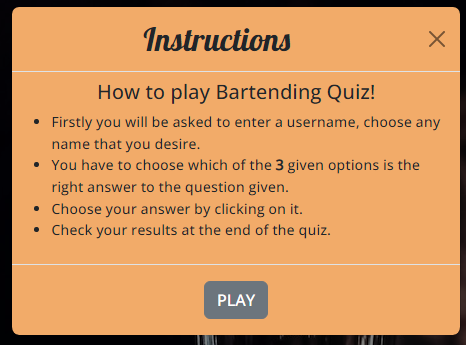

# **Bartending Quiz**

[View live site on Github Pages](https://edsonsmartins.github.io/PP2/)

## **Contents**
* [**Scope**](#scope)  
* [**User Experience UX**](#user-experience-ux)
    * [**User Stories**](#user-stories)
    * [**Site Owner Goals**](#site-owner-goals)
* [**Design Choices**](#design-choices)
    * [**Fonts**](#fonts)
    * [**Colours**](#colours)
    * [**Wireframes**](#wireframes)
* [**Technologies**](#technologies)
    * [**Languages**](#languages)
    * [**Libraries**](#libraries)
    * [**Frameworks \& Tools**](#frameworks--tools)
* [**Features**](#features)
    * [**Features Implemented**](#features-implemented)
    * [**Future Features**](#future-features)
* [**Version Control**](#version-control)
    * [**Gitpod Workspaces**](#gitpod-workspaces)
    * [**Gitpod branching and committing to GitHub**](#gitpod-branching-and-committing-to-GitHub)
* [**Testing**](#testing)
* [**Deployment**](#deployment)
* [**Development**](#development)
* [**Credits**](#credits)

Credits
## **Scope**
The Scope of this project is creating a website with the HTML,CSS and JavaScript framework. Users can test their knowledge of Bartending by playing an online quiz. The features include creating a username, colors to support the correct/incorrect answers, tracking the score and feedback.

[Back to contents](#contents)

## **User Experience UX**

### **User Stories**

- As a First Time User
    - I want to see the name of the quiz application.
    - I want to find instructions on how to play the game. 
    - I want to see the questions and three answer options.
    - I want to see my score at the end of the game.

-  As a user returning to the site:
   - I want to be able to do the quiz multiple times to get different results and see improvements while learning more about bartending.

- User Goals 
    - I want the site to be easy to navigate on mobile primarily so I can complete it on the go.
    - I want to be able to enter a username of my choice.     
    - I want to put my bartending knowledge to be tested with help of multiple choice.
     

[Back to contents](#contents)

### **Site Owner Goals** 
- As a site owner I want to test and educate users on Bartending. 
- As a site owner I want the site to be easy to navigate so that people will not only return but also share with friends.

[Back to contents](#contents)

## **Design Choices**

### **Fonts**
The Fonts used are [Open Sans](https://fonts.google.com/specimen/Open+Sans) and [Lobster](https://fonts.google.com/specimen/Lobster). I have selected Lobster mainly for headlines as it brings an elegant and vintage element that is certainly related to the art of bartending. Open Sans is a perfect match as it is readable, dislexia friendly and also brings an element of versatility which is a very important bartending caracheristic. 

[Back to contents](#contents)

### **Colours**
The idea behind the main colours was to use the match with the colours on the background image. Light orange to contrast and promote ease reading in contrast with white and black. The colors red and green appears during the game to identify which questions selected are correct or wrong.

Check format:[Colour Palette](https://coolors.co/fbbc74-071013-ffffff-fc0404-34eb8f)

[Back to contents](#contents)

### **Imagery**

The hero image on all pages is a bartender behind the bar sourced from [Unsplash](https://unsplash.com/photos/JWbHgJKx7jA) and it was the main reference to the selection of colors scheme applied on this online quiz.

### **Wireframes**
The wireframes were created using [Figma](https://www.figma.com) and can be found in pdf form in [wireframes](documentation/wireframes)
- Mobile view
    - [Home](documentation/wireframes/home_mobile.PNG)
    - [Username](documentation/wireframes/username_mobile.PNG)
    - [Game Play](documentation/wireframes/game_mobile.PNG)
    - [Results](documentation/wireframes/results_mobile.PNG)
    - [Leaderboard](documentation/wireframes/leaderboard_mobile.PNG)
    - [Help](documentation/wireframes/help_mobile.PNG)
- Desktop view
    - [Home](documentation/wireframes/home_desktop.PNG)
    - [Username](documentation/wireframes/username_desktop.PNG)
    - [Game Play](documentation/wireframes/game_desktop.PNG)
    - [Results](documentation/wireframes/results_desktop.PNG)
    - [Leaderboard](documentation/wireframes/leaderboard_desktop.PNG)
    - [Help](documentation/wireframes/help_desktop.PNG)

[Back to contents](#contents)

## **Technologies**

### **Languages**

- [HTML5](https://developer.mozilla.org/en-US/docs/Web/HTML)
  - Used as the main markup language for the website content.
- [CSS3](https://developer.mozilla.org/en-US/docs/Web/CSS)
  - Used to style the individual webpages.
- [JavaScript](https://developer.mozilla.org/en-US/docs/Web/JavaScript)
    - Used to show the questions through pagination and for the game play.

[Back to contents](#contents)

### **Libraries**

- [Bootstrap 5](https://getbootstrap.com/docs/5.0/getting-started/introduction/)
    - Used to implement components (navbar and modal) and for better mobile responsiveness. 
- [jQuery](https://jquery.com/) 
    - Used as click launch modal when load page.

[Back to contents](#contents)

### **Frameworks & Tools**
- [Git](https://git-scm.com/)
  - Git was used for version control (commit to Git and push to GitHub).
- [GitHub](https://github.com/)
  - Used to store, host and deploy the project files and source code after being pushed from Git. I also used it for the Project Kanban board to keep track and split tasks into smaller tasks to make them easier to fulfill.
- [Gitpod](https://www.gitpod.io/)
  - An online IDE linked to the GitHub repository used to write my code.
- [Google fonts](https://fonts.google.com/)
  - Used to compare and choose fonts. 
- [Coolors](https://coolors.co/)
  - Used to research and choose the colour scheme by comparing and contrasting similar colours in the generator.
- [Lighthouse](https://developers.google.com/web/tools/lighthouse)
  - Used to audit the site for quality and ensure responsiveness.
- [amiresponsive](http://ami.responsivedesign.is/)
  - An online tool to check how responsive the site is on different devices.
- [JSHint](https://jshint.com/)
    - Used to detect errors in the JavaScript files

[Back to contents](#contents)

## **Features**

### **Features Implemented**

The website has two pages with the following features: 

- **Header**
  - Contains a fixed and transparent navigation bar with Quiz name on left side which leads to home page and sections of the page listed on the right side.
  - On mobile view the navigation links collapse in to a toggle button and the menu closes after a link is pressed to avoid the user having to close the menu afterwards and to promote a easier user experience.     

- **Hero sections**
  - The same backgroung image is replicated on all pages to bring a sense of familiarity when browsing. 
  

#### *index.html*
 - **Modal**
   - The modal launches on page load and welcome the user giving the options to click to play the game or to the click and access intructions. The instructions is also designed in a modal format describing to the user how to play the quiz and has a link to game.html so users can imediately start the game. In case the modal is closed, user can still navigate by using the navigation bar in order to access the game, help and home. 

#### *game.html*
 - **Questions and Answers section**
    - The quiz section is loaded to game.html from the script.js file. The questions are exported from quiz.js and then imported and accessed by script.js to display on game.html.
    - Each question is followed by three options for the user to choose. If the right or wrong answer is selected, the user is presented with the correct answer.
    - A counter can be found right after the next button to show how many the user has gotten right.

 - **Results**
    - The results section is revealed once all of the questions have been asked and shows a feedback message and the total number of correct answers the user has gotten. To encourage users to keep playing, in this section users can click use a link to the game.html and the game reloaded from the start.

### **Future Features**
  - Timer
    - by implementing a timer, users will have to focus on each question avaiding wasting time and this could also reduce the chances of cheating while playing the quiz.
  - Leaderboard
    - this feature will estimulate users to invite friends to play the game and compete with them.
  - Age control
    - this tool is to be implemented to select and allow only users within the drinking age to be able to play the game. Perhaps those under the minimum drinking age, would be directed to a quiz suitable to their age.
  

[Back to contents](#contents)

## **Version Control**

**Version control** was managed within **GitHub** and **Gitpod** and regular commits pushed to **GitHub**. 

### Gitpod Workspaces
1. Starting from GitHub clone the [Code Institute template](https://github.com/Code-Institute-Org/gitpod-full-template) by clicking Use This Template and copying to my repository. The workspace is then launched by clicking GitPod.
2. Start the Gitpod Workspace which opens an **online IDE editor** window.

### Gitpod branching and committing to GitHub
1. I created various branches to work on different sections of code to push to master. I did this by typing into the terminal the commands: *git status* to find out which branch currently on; *git switch -c <*branchname*>* to create a new branch and switch to it immediately and then once the work was completed on that branch typed *git add <*files to be added*>* , *git commit -m <*commit message*>* and *git push --set-upstream <*remote*> <*branchname*>* to push to GitHub. I then created a pull request to pull the changes to the master if happy with the changes. From this point I would use *git -d <*branchname*>* to delete the local branch and delete the remote branch on GitHub. 
2. Meaningful commit messages were used to allow to roll back any changes made throughout the journey.

[Back to contents](#contents)

## **Testing**

- As a First Time User
    - I want to see the name of the quiz application.
     
    - I want to find instructions on how to play the game.
      
    - I want to see the questions and three answer options.
    
    - I want to see my score at the end of the game.
    

-  As a user returning to the site:
   - I want to be able to do the quiz multiple times to get different results and see improvements while learning more about bartending.
   
  
### **Lighthouse**
To test the performance, accessibility, best practices and SEO of the website, the Google developer tool Lighthouse was used. 

* 
* 

[Back to contents](#contents)

### **Validation**
**W3C Validator**

* [index.html]

* [game.html]

* [style.css]

**JSHint**

The *script.js* and *quiz.js* were both tested in [JSHint](https://jshint.com/) and no errors were found. 

[Back to contents](#contents)

## **Deployment**
Github Pages was used to deploy the website. The instructions to achieve this are:

1. Log in to Github.
2. Find the repository for the project, PP2.
3. Click on the Settings link.
4. Click on the Pages link in the navigation bar to the left.
5. In the Source section, choose main from the drop down select branch menu. Select Root from the drop down select folder menu.
6. Click Save. Your live Github Pages site will be deployed at the URL shown.

You can find the deployed site [here]

[Back to contents](#contents)

## **Development**
For local development the project repository can be found on GitHub.
-	Log in or sign up to Github.
-	Navigate to my GitHub profil, [EdsonSMartins](https://github.com/EdsonSMartins).
-	Locate the repository named *PP2*.
-	Click on the green *code* button and choose HTTPS, SSH or GitHubCLI and copy the preferred link. 
-	Open the IDE of your choice and create a directory where the repository should be stored using the terminal. 
-	Enter `git clone`, paste the copied URL and press enter.
-	The repository will be cloned to the selected repository.

[Back to contents](#contents)

## **Credits**

### **Code**

### **Content**

### **Images**

  ### **Acknowledgments**

